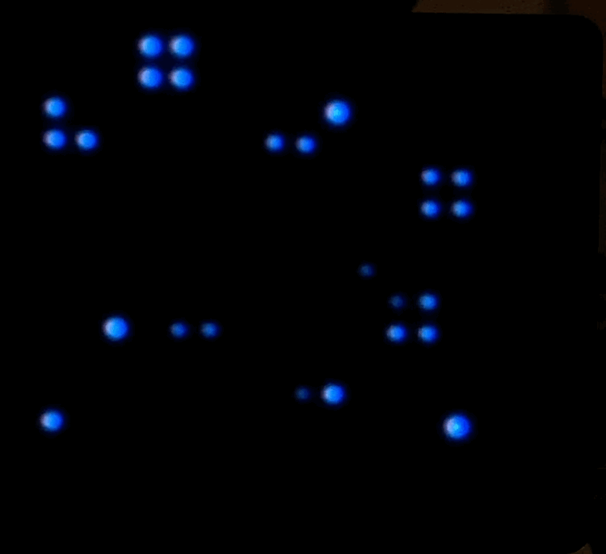

# The Screen™ (not really TM)

Made for the [Pimoroni Unicorn Hat HD](https://shop.pimoroni.com/products/unicorn-hat-hd), this program loads "slides" and switches between them while running. Each slide can run it's own logic, with the only limitation being that each iteration, it has to return a 2D Array (the resulting pixels to be displayed.)

There is also a web API (built with FastAPI) that allows remote control of 'The Screen', such as setting brighness, a specific slide, or rotation. The full list of endpoints can be found after hosting at hostname:port/docs.

A front-end UI is planned, but I have yet to decide on the technology.

In this repo, you'll find some slides I have already created:

| Game of Life       | Wolframs CA           
| ------------- |-------------
|  | 

| PONG (plays itself)       | Matrix       
| ------------- |-------------
|  | 

| PONG (plays itself)       | Demo Shader       
| ------------- |-------------
|  | 

| GIF Playback! (you may need to squint...)         
| -------------
|  

+ a few more examples taken from Pimoroni's GitHub repo.

Slides planned:
- Pendulum Simulation
- Snake
- Weather Forecast
- Sand/Water automata
- Perhaps 1v1 PONG via the planned Web UI.

## API
Since the API was built using FastAPI, documentation is generated and served on the server/docs endpoint, it also provides helpful error messages when the API is called incorrectly.

## Getting Started
Prerequisites: Powerful enough Raspberry Pi (currently running well on a Zero 2).
A [UnicornHatHD](https://shop.pimoroni.com/products/unicorn-hat-hd?variant=42496126730) for the display.  
- First, clone the repository and ensure Python >3.8 is installed.
- After this, move into 'the-screen' directory and run: `pip install -r requirements.txt`
- Then, you should be able to

## Slides
To create a slide, first create a folder with the slide name. Inside that folder, then create a python file with the same name, and another file with the same name, but the extension should be '.yapsy-plugin'

The python file should include a class that inherits from slide.BaseSlide, this file defines some class attributes, along with two methods:

1. init - called with width and height info
2. get_pixel - For pixel shading. called when slide.use_pixels = true. This will apply a function to a pixel, given x, y, and time as t. 
3. get_buffer - For when you want to handle the entire matrix generation. Used in more complicated slides, such that the slide can operate on the raw matrix, and return it as numpy 2d array for display. (the format of this: [[255, 0, 0], [0, 255, 0]... for each line])
